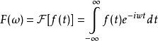

参考：
    http://wenku.baidu.com/link?url=ne9kZ2EzocDzKfDta_0-dUwCirfkjoArZ50TcMuhcY_XfWZZFll254zHPjzUbVYc7Wb1mH-j7XY3uL_gUkI3bsbvrd3jjvKzxlWVhae1Mea
    
    http://fileadmin.cs.lth.se/graphics/theses/projects/projgrid/projgrid-hq.pdf
    
    siggraph 2016
        http://advances.realtimerendering.com/s2016/

    js的fft
    http://www.ituring.com.cn/article/121428

合成方法  
  
Θ是角度，例如朝向x为0。

Gerstner 模型  

http://blog.csdn.net/jocyln9026/article/details/42103311

波速  
    
这个表达式的极限情况 

  

次摆线（trochoid）  
    海水粒子在原地做圆周运动，波峰的时候前进，波谷的时候后退。实际的会有一点的前进，但是相对于圆周运动来说范围较小。
    下一层的做小一点的反向圆周运动，再下一层，更小一点的正向圆周运动，大约1/9波长的时候，半径减半，2倍波长的时候只有前后晃动了。

    当波长不变，振幅增加的时候，次摆线的形状就会发生变化
    振幅和半径相同的时候，最尖，振幅再大就会出现交叠
    波高和波长之比为1:7的时候最尖，波高再大就不稳定了，会产生翻滚的海浪
    当靠近海岸的时候，底层的水速度降低，导致波长变短，波峰变高，形成浪花
    这时候还会有波浪的折射现象。

    方程：
    //α β θ
    x = aθ - bcos(θ)    
    y = a - bsin(θ) //这个改成 a+bsin(θ)的话，可以把波形颠倒过来
    b>a 长辐轮摆线
    b<a 短辐轮摆线 
    x会随着θ前进，y不会
    如果是每个粒子计算的话，不要前进，把aθ改成a

重力波
    海浪中的长波长部分。波长越大，波速越大
毛细波
     波长小于1.73cm的波，这时候表面张力的作用开始显现。这时候波速与波长成反比

     所以1.73cm的波长，波速最慢
  
波长和波速的关系

行进波

驻波

速度
    波长/周期 = 频率*波长

高度场
        

正态分布
    标准差 δ : v= Σ(di-μ)^2 , δ = sqrt( v/n )
    平均值 μ

  
如果μ=0，δ=1 就是标准化后的正态分布  

欧拉公式
    e^ix = cosx+isinx
    左边通过泰勒展开后，实数部分正好是cos的泰勒展开，虚数部分正好是sin的泰勒展开

## 傅里叶变换

相位谱的取值范围是 (-π, π]

一维和二维的
    二维积分。设二元函数f(a,b)，求积分
    如果先对b积分，
    g(a)=∫f(a,b)db
    ∫g(a)da
    如果先对a积分
    这两个虽然顺序不同，但是结果是相同的

二维的波形
    cos(k*(cosθ+sinθ)+ω*t+φ)
    当 θ = 0的时候，是沿着x方向，当 θ = π/2的时候，沿着y的方向。
    

我们用到的都是离散的，所以积分都是累加。
  
    X(k)=Σ(n=0,N-1)x(n)Wn^nk; k=0,N-1
    Wn = e^(-j2π/N)  
    需要对每个k都根据这个式子计算    

在没有主浪的时候剩下的都是随机的

直接叠加
    为什么是不规则的
    因为累加的时候，波矢量方向不同
关于方向
    二维的话，假设x轴和y轴各有一个独立的运动，则必然合成一个斜着的运动，
  
平面
摄像机
深度
天空

船的反射

天空盒的反射
    当水平的时候，是镜面的
    不能直接根据法线，而是根据摄像机到交点的反射光线

把贴图转成半球形
    纬度 latitude 
    经度 longitude

黑色部分
    因为反射的亮度差距比较大，必须要有一面是暗的    

加上贴图的亮度

